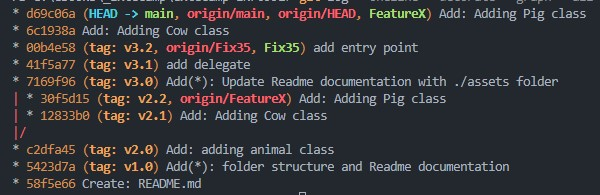

# Extecamp-INF0991

| Lucas Mellone, Antony Valete, Pedro Ferreira          |
|-------------------------------------------------------|

Este trabalho tem como objetivo desenvolver habilidades de uso de sistema de controle de versão Git via ferramentas do Visual Studio Code. Este trabalho compõe a avaliação da disciplina INF0991.

## Tags de versionamento
As tags de versionamento servem para identificar pontos específicos do andamento do projeto, como versões de release para o público, com features específicas (e.g. `v1.0.0`).

Para fazer isso, basta configurarmos as tags com as versões executando os seguintes comandos:
```shell
git tag -a v1.0 -m "version 1.0"
```
É importante atrelar a tag com o commit específico da mesma versão, para isso, ao lançar uma tag com uma versão, é recomendável executar a seguinte sequência de comandos:
```shell
git add <file>
git commit -m "Add(<file>): feature"
git tag -a v1.0.0 -m "version 1.0.0"
git push origin main
git push origin v1.0.0
```
Dessa forma, garantimos que este `push` em específico será atrelado à versão `1.0.0`.


## Release de uma tag
No GitHub também é possível criar o release de uma tag com uma versão específica. Para isso basta clicar no botão `Create a New Release` e selecionar a tag que se deseja publicar um release.

Essa ferramenta pode ser utilizada para gerar packages de instaladores e de código fonte de uma versão específica do programa que está sendo lançada para o público. 


## Rebase da branch
Executando o comando com a flag `rebase`, é possível integrar patches de mudanças introduzidas em diferentes branches. Se tivermos uma branch `feature` com novas features, poderemos implementá-la realizando o rebase a partir da `main`.
```shell
git checkout <feature>
git rebase main
```
Isso fará com que o ponto `HEAD` padrão agora seja apontado para a `<feature>` conforme o diagrama abaixo:

Só será possível completar o rebase, porém, se resolvermos os conflitos entre as diferentes branches em relação ao mesmo código. Para isso, podemos utilizar o editor de Merge do VSCode:


Após completar o merge com ambos os códigos (a depender a intenção de implementação), podemos então voltar para a branch `main` e realizar o `merge`.
```shell
git checkout main
git merge <feature>
git push origin main
```
Com isso poderemos ver nossas alterações no repositório remoto da versão mais atual da `main`, já com o merge da branch `<feature>`.

Ao executar o comando a seguir, poderemos verificar o seguinte Log de alterações:
```shell
git log --oneline --decorate --graph --all
```


Após completar o processo acima, finalmente teremos o `HEAD` da `main` e da branch `<feature>` apontando para a mesma versão:


Podemos então continuar o desenvolvimento a partir deste ponto, repetir o processo e criar novas branches com novas features.

## License
>MIT License. You can fork, copy, use, modify, and distribute this repository without restriction.